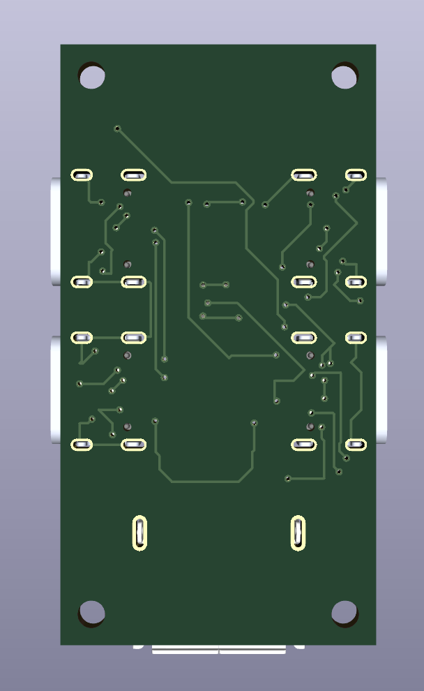

# mhmhub

Made by [Daamin](https://daamin.tech)

Features:

- USB-C input port
- 3x USB-C ports
- 1x USB-A port
- White Case
- Mounted PCB for stability

## Info

this hub is a 3x usbc port + 1x usba hub. it has a usb-c as the power source and connector to the host. it is also very teeny tiny.

I made this hub since i own a macbook and the hub i owned is pretty cheap and ugly. I wanted this hub to match my white keyboard and macropad. i added usb-a for my harddrives and usb-c for my keyboard and macropad.

## PCB

The PCB's size is 25.5mm x 48.5mm

| Schematic                 |
| ------------------------- |
|  |

| Front                 |
| --------------------- |
|  |

| Back                 |
| -------------------- |
|  |

| 3D - Front               |
| ------------------------ |
|  |

| 3D - Back               |
| ----------------------- |
|  |

## Case

The case was made in Fusion360.

## 3D Render:

## BOM - Products

| Name                 | Qty | Final Price - INR (USD) | Link                                                                                                                                       |
| -------------------- | --- | ----------------------- | ------------------------------------------------------------------------------------------------------------------------------------------ |
| PCBA                 | 2   | 2,597.77 ($30.4)        | [here](https://hc-cdn.hel1.your-objectstorage.com/s/v3/5fce6532436acc2e02ca682e6a3f78e5be402c24_screenshot_2025-06-27_at_7.26.42___pm.png) |
| PCB                  | 5   | 1210.01 ($14.16)        | [here](https://hc-cdn.hel1.your-objectstorage.com/s/v3/5fce6532436acc2e02ca682e6a3f78e5be402c24_screenshot_2025-06-27_at_7.26.42___pm.png) |
| USB-C to USB-C cable | 1   | 350 ($4.1)              | [here](https://amzn.in/d/gBN8jyo)                                                                                                          |
| M2 x 6mm Screws      | 25  | 224 ($2.62)             | [here](https://amzn.in/d/dhuYR6N)                                                                                                          |
| USB-C to USB-C cable | 50  | 250 ($2.93)             | [here](https://amzn.in/d/iHDKn9j)                                                                                                          |
| Top Case             | 1   | NA                      | print legion                                                                                                                               |
| Bottom Case          | 1   | NA                      | print legion                                                                                                                               |

## Total Pricing

The total comes out to be approximately 4632 INR ($54.21). Does not include 3D - Printed case.

## Notes :-

I want all the three 3D-printed parts to be printed in white color.

Some of the above items, were ordered in packs due to unavailability of singular items.
The pricing might slightly vary due to flash sales, and dollar market trends.
